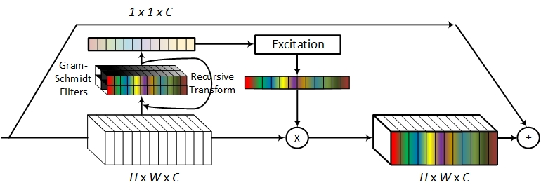

# WaveNet: Wavelet Channel Attention Networks
PyTorch implementation of the paper "[WaveNet: Wavelet Channel Attention Networks](https://arxiv.org/abs/2012.11879)".

# Install
Please see [INSTALL.md](./INSTALL.md)

# Training
Please see `launch_training_classification.sh` and `launch_training_detection.sh` for training on ImageNet and COCO, respectively.

# Testing
Please see `launch_eval_classification.sh` and `launch_eval_detection.sh` for testing on ImageNet and COCO, respectively.

